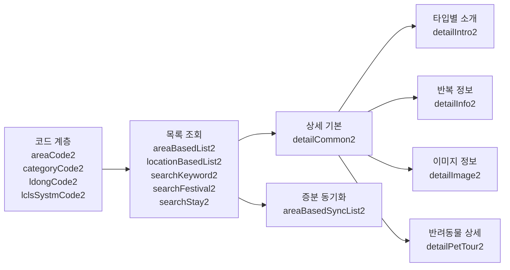

# 한국관광콘텐츠랩 TourAPI OpenAPI 목록 심층 분석 보고서

## 요약

한국관광콘텐츠랩의 TourAPI 4.x 계열은 한국관광공사가 보유한 관광지·숙박·행사·이미지·분류코드·동기화 정보를 REST 방식으로 제공하는 공개 API군이다. 국문 관광정보 서비스의 공공데이터포털 설명 기준으로 제공 형식은 JSON+XML, 업데이트 주기는 실시간, 개발계정 기본 트래픽은 1,000이며 운영계정은 활용사례 등록을 통해 증설 가능하다. 또한 2025년 5월 이후 `KorService1`에서 `KorService2`로, 2026년 1월에는 반려동물 서비스가 `KorPetTourService2`로 재편되면서 일부 URL과 입출력 항목이 바뀌었다. 실무적으로는 **코드 조회 API → 목록 조회 API → 상세 조회 API → 이미지/반복/소개 API** 순으로 조합하는 것이 가장 안정적이다. citeturn9view0turn39search4turn23view0

이번 조사에서 가장 중요한 발견은 네 가지다. 첫째, 공식 한국어 문서는 최신성 면에서 가장 신뢰할 수 있지만, 웹 파싱으로는 모든 Swagger 세부 항목이 노출되지 않는다. 둘째, 영문 공공데이터포털 페이지는 일부 엔드포인트의 요청 파라미터를 텍스트로 노출해 실무 파라미터 검증에 매우 유용하다. 셋째, 2026년 공지로 법정동 코드(`lDong*`)와 신분류 코드(`lclsSystm*`)가 핵심 필터로 추가되었고, 기존 `areaCode/sigunguCode/cat1/cat2/cat3`는 상당수가 “미사용 예정” 또는 대체 예정으로 표기된다. 넷째, `detailCommon2`는 구버전 대비 대폭 단순화되어 `contentTypeId`와 각종 `...YN` 플래그를 더 이상 받지 않는 방향으로 정리되었다. citeturn23view0turn11view2turn36search2

아래 보고서는 한국어 공식 문서를 우선 기준으로 삼고, 공식 페이지에서 파싱되지 않는 세부 요청항목은 동일 기관의 영문 공공데이터포털 페이지와 공개 변경 공지, 그리고 보조 사양 문서를 보조 근거로 사용했다. 공식 사이트에서 확인되지 않는 부분은 모두 **“미지정”** 으로 표시했다. citeturn9view0turn10search2turn23view0turn15view0

## 조사 범위와 문서 기준

이번 보고서의 1차 기준 문서는 한국관광콘텐츠랩 TourAPI 랜딩 페이지, 공공데이터포털의 **한국관광공사_국문 관광정보 서비스_GW** 상세 페이지, 그리고 2025·2026년 변경 공지다. 한국어 상세 페이지는 서비스 성격, 트래픽, 라이선스, 제공 범위, 수정일 같은 운영 메타데이터를 가장 명확하게 제공한다. 반면 요청 파라미터의 전체 표는 웹 검색 노출 한계가 있어, 공공데이터포털의 영문 상세 페이지에서 노출되는 텍스트를 보조적으로 활용했다. citeturn10search1turn9view0turn31search0turn23view0turn39search4

원문 문서 링크는 다음 공식 페이지들이다. TourAPI 포털 메인과 활용 매뉴얼 진입점은 한국관광콘텐츠랩에 있고, 데이터셋 운영 메타데이터와 활용신청은 공공데이터포털에 있으며, 오퍼레이션 변경사항은 공지사항으로 관리된다. 응답 예시와 샘플 코드는 Swagger UI에서 확인하도록 안내되지만, 공식 가이드 자체가 “PC에서 확인”을 전제로 한다. citeturn10search1turn9view0turn4view0turn10search2

| 문서 | 용도 | 비고 | 링크 |
|---|---|---|---|
| 한국관광콘텐츠랩 | TourAPI 진입점, 안내 허브 | 한국어 공식 포털 | citeturn10search1 |
| 한국관광공사_국문 관광정보 서비스_GW | 서비스 메타데이터, 트래픽, 라이선스 | 1차 기준 문서 | citeturn9view0 |
| OPENAPI Detail 영문 페이지 | 파싱 가능한 요청 파라미터 표 | 보조 기준 문서 | citeturn10search2turn31search0turn40search0 |
| Open API 명세 확인 가이드 | Swagger 사용법, 인증키 입력 방식 | 샘플 실행 안내 | citeturn4view0 |
| 2025 URL 변경 공지 | `*Service1` → `*Service2` 전환 | 버전 마이그레이션 참고 | citeturn39search4 |
| 2026 반려동물 서비스 변경 공지 | `KorPetTourService2` 전환, 신규/변경 항목 | Pet API 별도 분리 근거 | citeturn23view0 |

## 공통 규격

모든 TourAPI 4.x 요청은 기본적으로 REST `GET`이며, 서비스키(`serviceKey`), 클라이언트 식별용 `MobileOS`, `MobileApp`가 공통 기준으로 반복된다. 실무 보조 문서는 `_type=json`을 기본값처럼 강하게 권장하지만, 공식 파라미터 표에서는 `_type`은 선택값이고, 생략 시 XML이 기본 응답 형식이라고 설명한다. 따라서 생산 서비스에서는 JSON 사용을 원한다면 `_type=json`을 명시하는 편이 안전하다. citeturn11view0turn31search0turn15view0

기본 베이스 URL은 국문 서비스 기준 `https://apis.data.go.kr/B551011/KorService2`로 보는 것이 타당하다. 공식 검색 색인에는 `http://` 요청주소가 반복 노출되지만, 같은 데이터셋 검색 결과에는 `Schemes. https, http.`가 함께 표기된다. 운영 환경에서는 키 노출과 중간자 공격 위험을 줄이기 위해 HTTPS만 쓰는 편이 맞다. 2025년 5월 공지에서 국문/영문/일문/중문/불어/독어/서어/노어/무장애 서비스가 일괄적으로 `*Service2`로 이행되었고, 구 URL은 90일 후 중지되었다. citeturn19search1turn39search4

인증은 **공공데이터포털의 활용신청 후 발급받는 서비스키** 방식이다. 공식 가이드에는 Swagger UI 상단의 `Authorize`에서 발급받은 **Decoding 인증키**를 입력하라고 설명되어 있으며, 요청 파라미터 표는 일반 REST 호출에서 `serviceKey`를 **URL-Encode** 하라고 적는다. 즉, 브라우저 Swagger에서 테스트할 때는 디코딩 키 입력, 실제 URL 조립 시에는 인코딩된 키 전달이 권장된다. 활용신청은 PC 버전에서만 가능하다고 공식 영문 페이지에 명시되어 있다. citeturn4view0turn11view0turn31search0

공통 페이지네이션 필드는 `pageNo`와 `numOfRows`이며, 공식 파싱 가능한 표에서는 대부분 기본 샘플값이 각각 `1`, `10`으로 제시된다. 보조 사양 문서는 성공 응답을 `response.header.resultCode == "0000"`로 판단하고, `response.body.pageNo`, `numOfRows`, `totalCount`, `items.item`을 함께 파싱하라고 권고한다. 또한 `items.item`은 배열일 수도 단일 객체일 수도 있고, 검색 결과가 없을 때 `items`가 빈 문자열로 내려오는 사례가 있어 파서 방어 로직이 필요하다. citeturn11view0turn31search0turn29search2turn29search3

공식 한국어 페이지는 개발계정 트래픽을 **1,000**으로 적고, 운영계정은 활용사례 등록 시 트래픽 증가 신청이 가능하다고 밝힌다. 반면 영문 자동번역 페이지는 일부 엔드포인트에서 `100000`을 노출하지만, 최신 한국어 페이지와 최근 공지의 정합성을 고려하면 운영 기준값은 한국어 페이지를 따라가는 것이 합리적이다. 따라서 이 보고서의 rate limit 표기는 한국어 페이지를 우선한다. citeturn9view0turn31search0

공식 문서가 엔드포인트별 세부 오류 코드 목록을 현재 텍스트로 노출하지는 않지만, 공통적으로 “오픈API 에러코드” 메뉴를 제공한다. 실무적으로는 오류를 세 층으로 나누는 것이 안전하다. 네트워크/HTTP 오류, 공급자 헤더 오류(`resultCode != 0000`), 그리고 잘못된 요청 파라미터 오류다. 공식 세부 retry 정책은 **미지정** 이므로, GET 호출의 특성상 429·5xx·네트워크 타임아웃에는 지수 백오프 재시도, 4xx 파라미터 오류에는 재시도하지 말고 요청 수정 후 재호출하는 방식을 권장한다. 이 부분은 공식 제한 문서와 응답 검증 규칙을 조합한 **실무 권고**다. citeturn20search0turn29search2turn15view0

아래 다이어그램은 TourAPI를 실제 서비스에서 연결하는 가장 일반적인 흐름이다. 법정동·분류체계 코드 계층을 먼저 확보하고, 목록 API에서 `contentid`를 얻은 뒤, 상세/소개/반복/이미지 API를 후속 호출하는 구조가 표준적이다. citeturn23view0turn15view0turn25search6



### 공통 cURL 예시

```bash
curl -G 'https://apis.data.go.kr/B551011/KorService2/areaCode2' \
  --data-urlencode 'serviceKey=YOUR_ENCODED_SERVICE_KEY' \
  --data 'MobileOS=ETC' \
  --data-urlencode 'MobileApp=MyTourApp' \
  --data '_type=json'
```

### 공통 Python 예시

```python
import requests

BASE = "https://apis.data.go.kr/B551011/KorService2"
COMMON = {
    "serviceKey": "YOUR_ENCODED_SERVICE_KEY",
    "MobileOS": "ETC",
    "MobileApp": "MyTourApp",
    "_type": "json",
}

resp = requests.get(f"{BASE}/areaCode2", params=COMMON, timeout=10)
resp.raise_for_status()
print(resp.json())
```

### 공통 JSON 응답 골격

```json
{
  "response": {
    "header": {
      "resultCode": "0000",
      "resultMsg": "OK"
    },
    "body": {
      "items": {
        "item": []
      },
      "numOfRows": 10,
      "pageNo": 1,
      "totalCount": 0
    }
  }
}
```

### 공통 XML 골격

```xml
<response>
  <header>
    <resultCode>0000</resultCode>
    <resultMsg>OK</resultMsg>
  </header>
  <body>
    <items>
      <item>...</item>
    </items>
    <numOfRows>10</numOfRows>
    <pageNo>1</pageNo>
    <totalCount>0</totalCount>
  </body>
</response>
```

공통 데이터 타입은 문자열 중심이며, 실무 보조 사양은 `contentid`, `mapx`, `mapy`, `dist`처럼 숫자처럼 보이는 값도 문자열로 올 수 있으므로 안전하게 파싱하라고 권고한다. 날짜 필터는 주로 `YYYYMMDD`, 일부 생성·수정 시각 필드는 `YYYYMMDDHHMMSS` 형태로 관측된다. 좌표는 공식 문서에 WGS84 경도(`mapX`)·위도(`mapY`)로 설명되어 있다. citeturn11view2turn31search0turn30search5turn30search2

## API 비교표와 추천 매핑

아래 표는 TourAPI 국문 계열 핵심 엔드포인트를 기능 중심으로 압축한 것이다. `detailPetTour2`는 원래 국문 관광정보 서비스 검색 색인에도 나타나지만, 2026년 1월 공식 공지 이후에는 반려동물 전용 서비스 `KorPetTourService2`에서 운영되는 것으로 보는 것이 최신 해석에 가깝다. citeturn8search0turn23view0

| API | 범주 | 1차 용도 | 인증 | 응답 형식 | 기본 트래픽 | 근거 |
|---|---|---|---|---|---|---|
| areaCode2 | 코드 | 시도/시군구 지역코드 조회 | serviceKey | JSON+XML | 개발 1,000 | citeturn40search0turn9view0 |
| categoryCode2 | 코드 | 서비스 분류코드 조회 | serviceKey | JSON+XML | 개발 1,000 | citeturn8search0turn9view0 |
| ldongCode2 | 코드 | 법정동 시도/시군구 코드 조회 | serviceKey | JSON+XML | 개발 1,000 | citeturn23view0turn25search2turn9view0 |
| lclsSystmCode2 | 코드 | 신분류체계 코드 조회 | serviceKey | JSON+XML | 개발 1,000 | citeturn23view0turn25search2turn9view0 |
| areaBasedList2 | 목록 | 지역 조건 기반 관광 목록 | serviceKey | JSON+XML | 개발 1,000 | citeturn23view0turn39search4turn9view0 |
| locationBasedList2 | 목록 | 좌표 반경 기반 주변 검색 | serviceKey | JSON+XML | 개발 1,000 | citeturn11view0turn9view0 |
| searchKeyword2 | 검색 | 자유 텍스트 키워드 검색 | serviceKey | JSON+XML | 개발 1,000 | citeturn23view0turn13search1turn9view0 |
| searchFestival2 | 검색 | 행사/축제 목록 검색 | serviceKey | JSON+XML | 개발 1,000 | citeturn31search0turn9view0 |
| searchStay2 | 검색 | 숙박 목록 검색 | serviceKey | JSON+XML | 개발 1,000 | citeturn24search0turn9view0 |
| detailCommon2 | 상세 | 상세 공통 정보 | serviceKey | JSON+XML | 개발 1,000 | citeturn23view0turn36search2turn9view0 |
| detailIntro2 | 상세 | 관광타입별 소개/운영 정보 | serviceKey | JSON+XML | 개발 1,000 | citeturn24search0turn23view0turn9view0 |
| detailInfo2 | 상세 | 반복/세부 구성 정보 | serviceKey | JSON+XML | 개발 1,000 | citeturn24search0turn23view0turn9view0 |
| detailImage2 | 미디어 | 대표/상세 이미지 조회 | serviceKey | JSON+XML | 개발 1,000 | citeturn24search0turn36search2turn9view0 |
| areaBasedSyncList2 | 동기화 | 증분 동기화 목록 | serviceKey | JSON+XML | 개발 1,000 | citeturn25search2turn9view0 |
| detailPetTour2 | 반려동물 | 반려동물 동반 상세 정보 | serviceKey | JSON+XML | 개발 1,000 | citeturn23view0turn28search3 |

아래 매핑은 “어떤 문제에 어떤 API를 먼저 써야 하는가”를 기준으로 정리한 실무 추천이다. 특히 **교통(transportation)** 과 **통계(statistics)** 는 현재 이 매뉴얼의 핵심 15종에 전용 API가 없다. 따라서 TourAPI는 POI 탐색과 콘텐츠 설명용이고, 길찾기나 집계 통계는 별도 API를 결합해야 한다. citeturn9view0turn39search11

| 요구사항 | 가장 적합한 API | 보조 API | 해설 | 근거 |
|---|---|---|---|---|
| 관광지 탐색 | areaBasedList2 | locationBasedList2, searchKeyword2, detailCommon2 | 행정/지역 필터, 주변 탐색, 키워드 탐색을 조합 | citeturn11view0turn23view0turn25search6 |
| 숙박 | searchStay2 | detailCommon2, detailIntro2, detailImage2 | 숙박 전용 검색 후 상세/운영/이미지 결합 | citeturn24search0turn25search6 |
| 행사/축제 | searchFestival2 | detailCommon2, detailIntro2, detailImage2 | 시작일 필수, 행사 일정 필드 포함 | citeturn31search0turn30search2 |
| 교통 | 전용 API 미지정 | detailCommon2의 좌표 + 외부 경로 API | TourAPI는 POI/콘텐츠 API, 경로탐색 전용 아님 | citeturn9view0turn11view0 |
| 이미지 | detailImage2 | detailCommon2 | 이미지 전용 API, 저작권 코드 확인 권장 | citeturn24search0turn15view0 |
| 통계 | 전용 API 미지정 | 별도 관광통계·데이터랩 계열 | 이 매뉴얼 핵심 15종에는 통계 집계 API 부재 | citeturn9view0turn39search11 |

## 엔드포인트별 분석

아래 엔드포인트들은 모두 **공통 인증(serviceKey), 공통 클라이언트 식별(MobileOS, MobileApp), 선택 응답 형식(_type=json), 공통 트래픽 정책(개발계정 1,000)** 을 상속한다. 또한 `sigunguCode → areaCode`, `cat2 → cat1`, `cat3 → cat1+cat2`, `lDongSignguCd → lDongRegnCd`, `lclsSystm2 → lclsSystm1`, `lclsSystm3 → lclsSystm1+lclsSystm2` 의 의존 규칙은 대부분 공통으로 적용된다. 별도 언급이 없으면 오류/재시도 정책도 공통 규격을 따른다. citeturn30search3turn15view0turn9view0

### 코드 조회 계열

#### areaCode2

`areaCode2`는 시도 코드와 시군구 코드를 조회하는 가장 기본적인 선행 API다. 공식 파싱 가능한 문서 기준으로 메서드는 `GET`, 필수 파라미터는 `serviceKey`, `MobileOS`, `MobileApp`, 선택 파라미터는 `areaCode`, `pageNo`, `numOfRows`, `_type`이다. `areaCode`를 생략하면 시도 목록, 입력하면 해당 시도의 시군구 목록을 받는 구조로 해석하는 것이 자연스럽다. citeturn40search0

| 항목 | 내용 |
|---|---|
| API명 / 목적 | areaCode2 / 시도·시군구 지역코드 조회 |
| 메서드 / URL | GET / `https://apis.data.go.kr/B551011/KorService2/areaCode2` |
| 필수 파라미터 | `serviceKey:string`, `MobileOS:string`, `MobileApp:string` |
| 선택 파라미터 | `areaCode:string`, `pageNo:int=1`, `numOfRows:int=10`, `_type:string` |
| 형식 / 검증 | `areaCode`는 코드값, `_type=json` 생략 시 XML |
| 대표 응답 필드 | `rnum:int`, `code:string`, `name:string` |
| 대표 시나리오 | 시도 선택 박스, 시군구 종속 드롭다운, 지역 필터 초기화 |
| 미지정 항목 | 세부 validation rule, endpoint별 고유 오류코드 |

```bash
curl -G 'https://apis.data.go.kr/B551011/KorService2/areaCode2' \
  --data-urlencode 'serviceKey=YOUR_ENCODED_SERVICE_KEY' \
  --data 'MobileOS=ETC' \
  --data-urlencode 'MobileApp=MyTourApp' \
  --data '_type=json' \
  --data 'areaCode=1'
```

```python
params = {**COMMON, "areaCode": "1"}
r = requests.get(f"{BASE}/areaCode2", params=params, timeout=10)
print(r.json())
```

```json
{
  "response": {
    "header": {"resultCode": "0000", "resultMsg": "OK"},
    "body": {
      "items": {
        "item": [
          {"rnum": 1, "code": "1", "name": "강남구"}
        ]
      },
      "numOfRows": 10,
      "pageNo": 1,
      "totalCount": 25
    }
  }
}
```

대표 필드 설명은 `rnum`(행 번호, 정수), `code`(지역코드, 문자열), `name`(지역명, 문자열)로 보는 것이 안전하다. 검색 결과 예시에서도 동일 구조가 확인된다. citeturn40search0turn29search4

#### categoryCode2

`categoryCode2`는 서비스 분류코드 조회 API다. 공식 한국어 색인에는 엔드포인트 존재가 확인되지만, 현재 파싱 가능한 텍스트에서는 요청 파라미터 표가 직접 노출되지 않는다. 다만 공통 의존 규칙에서 `cat2`는 `cat1`, `cat3`는 `cat1`과 `cat2`를 요구하므로, 계층형 카테고리 조회/필터링 API로 해석하는 것이 타당하다. 내용 타입(`contentTypeId`)과 상위 카테고리 조합을 함께 쓰는 구성이 업계 관행과 보조 문서에서 일치한다. 이 부분은 공식 색인과 보조 사양을 결합한 해석이다. citeturn8search0turn30search3turn25search6

| 항목 | 내용 |
|---|---|
| API명 / 목적 | categoryCode2 / 관광 서비스 분류코드 조회 |
| 메서드 / URL | GET / `https://apis.data.go.kr/B551011/KorService2/categoryCode2` |
| 필수 파라미터 | `serviceKey`, `MobileOS`, `MobileApp` |
| 선택 파라미터 | `contentTypeId`, `cat1`, `cat2`, `cat3`, `pageNo`, `numOfRows`, `_type` |
| 형식 / 검증 | `cat2`는 `cat1` 필요, `cat3`는 `cat1+cat2` 필요 |
| 대표 응답 필드 | `rnum`, `code`, `name` |
| 대표 시나리오 | 업종/테마 필터, 카테고리 트리 구축 |
| 미지정 항목 | 공식 파싱 문서 기준 상세 파라미터 표, 기본값 |

```bash
curl -G 'https://apis.data.go.kr/B551011/KorService2/categoryCode2' \
  --data-urlencode 'serviceKey=YOUR_ENCODED_SERVICE_KEY' \
  --data 'MobileOS=ETC' \
  --data-urlencode 'MobileApp=MyTourApp' \
  --data '_type=json' \
  --data 'contentTypeId=12' \
  --data 'cat1=A01'
```

```python
params = {**COMMON, "contentTypeId": "12", "cat1": "A01"}
r = requests.get(f"{BASE}/categoryCode2", params=params, timeout=10)
print(r.json())
```

```json
{
  "response": {
    "header": {"resultCode": "0000", "resultMsg": "OK"},
    "body": {
      "items": {
        "item": [
          {"rnum": 1, "code": "A0101", "name": "자연"}
        ]
      }
    }
  }
}
```

응답 예시의 `code/name` 구조는 코드 조회 계열의 공통 패턴을 따른다. 다만 `level` 등 추가 필드의 공식 텍스트 노출은 현재 **미지정** 이다. citeturn29search4turn8search0

#### ldongCode2

`ldongCode2`는 2026년 1월 공식 공지에서 신규 추가가 명시된 API로, 시도·시군구 기준의 법정동 코드를 조회한다. 요청 파라미터는 `lDongRegnCd`와 `lDongListYn`가 공식 공지에 직접 적혀 있다. `lDongRegnCd`가 없으면 전체 시도 목록을 호출하고, `lDongListYn`은 `N`이면 코드 조회, `Y`이면 전체 목록 조회를 의미한다. 응답 필드는 모드에 따라 달라진다. citeturn23view0

| 항목 | 내용 |
|---|---|
| API명 / 목적 | ldongCode2 / 법정동 시도·시군구 코드 조회 |
| 메서드 / URL | GET / `https://apis.data.go.kr/B551011/KorService2/ldongCode2` |
| 필수 파라미터 | `serviceKey`, `MobileOS`, `MobileApp` |
| 선택 파라미터 | `lDongRegnCd`, `lDongListYn`, `pageNo`, `numOfRows`, `_type` |
| 형식 / 검증 | `lDongListYn`: `N` 또는 `Y`; `lDongRegnCd` 없으면 전체 시도 |
| 대표 응답 필드 | `name`, `code` 또는 `lDongRegnCd`, `lDongRegnNm`, `lDongSignguCd`, `lDongSignguNm` |
| 대표 시나리오 | 행정구역 최신 필터, 법정동 기반 검색 전처리 |
| 미지정 항목 | `lDongListYn` 기본값 |

```bash
curl -G 'https://apis.data.go.kr/B551011/KorService2/ldongCode2' \
  --data-urlencode 'serviceKey=YOUR_ENCODED_SERVICE_KEY' \
  --data 'MobileOS=ETC' \
  --data-urlencode 'MobileApp=MyTourApp' \
  --data '_type=json' \
  --data 'lDongRegnCd=11' \
  --data 'lDongListYn=Y'
```

```python
params = {**COMMON, "lDongRegnCd": "11", "lDongListYn": "Y"}
r = requests.get(f"{BASE}/ldongCode2", params=params, timeout=10)
print(r.json())
```

```json
{
  "response": {
    "header": {"resultCode": "0000", "resultMsg": "OK"},
    "body": {
      "items": {
        "item": [
          {
            "lDongRegnCd": "11",
            "lDongRegnNm": "서울특별시",
            "lDongSignguCd": "140",
            "lDongSignguNm": "중구"
          }
        ]
      }
    }
  }
}
```

이 API는 기존 `areaCode/sigunguCode`보다 최신 필터 체계에 가깝기 때문에, 신규 개발이라면 지역 필터 마스터 테이블을 `ldongCode2` 기준으로 구성하는 편이 유리하다. citeturn23view0turn11view2

#### lclsSystmCode2

`lclsSystmCode2`도 2026년 1월 공식 공지에서 신규 추가가 확인된다. 요청 파라미터는 `lclsSystm1`, `lclsSystm2`, `lclsSystm3`, `lclsSystmListYn`이며, `lclsSystm2`는 `lclsSystm1`이, `lclsSystm3`는 `lclsSystm1·lclsSystm2`가 필요하다. 응답 역시 조회 모드에 따라 `code/name` 또는 정규화된 분류체계 코드명 집합으로 달라진다. citeturn23view0turn30search3

| 항목 | 내용 |
|---|---|
| API명 / 목적 | lclsSystmCode2 / 신분류체계 코드 조회 |
| 메서드 / URL | GET / `https://apis.data.go.kr/B551011/KorService2/lclsSystmCode2` |
| 필수 파라미터 | `serviceKey`, `MobileOS`, `MobileApp` |
| 선택 파라미터 | `lclsSystm1`, `lclsSystm2`, `lclsSystm3`, `lclsSystmListYn`, `pageNo`, `numOfRows`, `_type` |
| 형식 / 검증 | `lclsSystm2`는 `lclsSystm1` 필요, `lclsSystm3`는 `lclsSystm1+lclsSystm2` 필요 |
| 대표 응답 필드 | `name`, `code` 또는 `lclsSystm1Cd`, `lclsSystm1Nm`, `lclsSystm2Cd`, `lclsSystm2Nm`, `lclsSystm3Cd`, `lclsSystm3Nm` |
| 대표 시나리오 | 테마 분류 트리, 검색 필터 고도화, 추천 모델 라벨링 |
| 미지정 항목 | `lclsSystmListYn` 기본값 |

```bash
curl -G 'https://apis.data.go.kr/B551011/KorService2/lclsSystmCode2' \
  --data-urlencode 'serviceKey=YOUR_ENCODED_SERVICE_KEY' \
  --data 'MobileOS=ETC' \
  --data-urlencode 'MobileApp=MyTourApp' \
  --data '_type=json' \
  --data 'lclsSystm1=FD' \
  --data 'lclsSystmListYn=Y'
```

```python
params = {**COMMON, "lclsSystm1": "FD", "lclsSystmListYn": "Y"}
r = requests.get(f"{BASE}/lclsSystmCode2", params=params, timeout=10)
print(r.json())
```

```json
{
  "response": {
    "header": {"resultCode": "0000", "resultMsg": "OK"},
    "body": {
      "items": {
        "item": [
          {
            "lclsSystm1Cd": "FD",
            "lclsSystm1Nm": "음식",
            "lclsSystm2Cd": "FD01",
            "lclsSystm2Nm": "한식"
          }
        ]
      }
    }
  }
}
```

이 API는 기존 `cat1/2/3`보다 향후 호환성이 높다. 공식 공지가 기존 분류코드를 “대체 예정”으로 명시하기 때문이다. citeturn23view0turn11view2

### 목록·검색 계열

#### areaBasedList2

`areaBasedList2`는 지역 기반 관광정보 목록 조회 API다. 2025년 `areaBasedList`에서 `areaBasedList2`로 넘어왔고, 2026년에는 법정동·신분류 필터가 추가되었다. 공식 파싱 텍스트로는 전체 파라미터 표가 직접 노출되지 않지만, 변경 공지와 공통 의존 규칙을 종합하면 `areaCode/sigunguCode` 또는 `lDong*`, `cat*` 또는 `lclsSystm*`, `contentTypeId`, `modifiedtime`, `arrange`, 페이지네이션을 함께 쓰는 구조로 보는 것이 타당하다. citeturn39search4turn23view0turn30search3

| 항목 | 내용 |
|---|---|
| API명 / 목적 | areaBasedList2 / 지역 중심 관광 목록 조회 |
| 메서드 / URL | GET / `https://apis.data.go.kr/B551011/KorService2/areaBasedList2` |
| 필수 파라미터 | `serviceKey`, `MobileOS`, `MobileApp` |
| 선택 파라미터 | `contentTypeId`, `areaCode`, `sigunguCode`, `lDongRegnCd`, `lDongSignguCd`, `cat1`, `cat2`, `cat3`, `lclsSystm1`, `lclsSystm2`, `lclsSystm3`, `modifiedtime`, `arrange`, `pageNo`, `numOfRows`, `_type` |
| 형식 / 검증 | `sigunguCode→areaCode`, `cat2→cat1`, `cat3→cat1+cat2`, `lDongSignguCd→lDongRegnCd`, `lclsSystm2→1`, `lclsSystm3→1+2` |
| 대표 응답 필드 | `contentid`, `contenttypeid`, `title`, `addr1`, `firstimage`, `mapx`, `mapy`, `areacode`, `sigungucode` |
| 대표 시나리오 | 지역별 관광지 카드 목록, 행정구역 필터형 서비스 |
| 미지정 항목 | 공식 파싱 문서의 기본 정렬값, endpoint별 응답 요소 전체표 |

```bash
curl -G 'https://apis.data.go.kr/B551011/KorService2/areaBasedList2' \
  --data-urlencode 'serviceKey=YOUR_ENCODED_SERVICE_KEY' \
  --data 'MobileOS=ETC' \
  --data-urlencode 'MobileApp=MyTourApp' \
  --data '_type=json' \
  --data 'areaCode=1' \
  --data 'contentTypeId=12' \
  --data 'numOfRows=20' \
  --data 'pageNo=1'
```

```python
params = {
    **COMMON,
    "areaCode": "1",
    "contentTypeId": "12",
    "numOfRows": 20,
    "pageNo": 1,
}
r = requests.get(f"{BASE}/areaBasedList2", params=params, timeout=10)
print(r.json())
```

```json
{
  "response": {
    "header": {"resultCode": "0000", "resultMsg": "OK"},
    "body": {
      "items": {
        "item": [
          {
            "contentid": "126508",
            "contenttypeid": "12",
            "title": "경복궁",
            "addr1": "서울특별시 종로구 사직로 161",
            "firstimage": "https://...",
            "mapx": "126.9770",
            "mapy": "37.5788",
            "areacode": "1",
            "sigungucode": "23"
          }
        ]
      }
    }
  }
}
```

`areaBasedList2`는 가장 “범용적인 목록 API”다. 검색어 없이 지역과 타입으로 좁힐 수 있어, 초기 홈 화면이나 카테고리 탐색형 UX에 특히 적합하다. citeturn23view0turn30search2

#### locationBasedList2

`locationBasedList2`는 파싱 가능한 공식 문서가 가장 잘 보이는 엔드포인트다. 필수 파라미터는 `mapX`, `mapY`, `radius`, `serviceKey`, `MobileOS`, `MobileApp`이며, `radius` 최대값은 20,000m로 공식 표에 직접 적혀 있다. 정렬값은 거리 정렬을 포함해 `A/C/D/E`와 대표이미지 보유 항목 전용 `O/Q/R/S`가 문서화되어 있다. 또한 2026년 기준 `lDong*`, `lclsSystm*` 필터가 추가되었고, `areaCode/sigunguCode/cat1/cat2/cat3`는 미사용 예정으로 표기된다. citeturn11view2turn23view0

| 항목 | 내용 |
|---|---|
| API명 / 목적 | locationBasedList2 / 좌표 반경 기반 주변 관광정보 조회 |
| 메서드 / URL | GET / `https://apis.data.go.kr/B551011/KorService2/locationBasedList2` |
| 필수 파라미터 | `mapX:decimal`, `mapY:decimal`, `radius:int`, `serviceKey`, `MobileOS`, `MobileApp` |
| 선택 파라미터 | `contentTypeId`, `modifiedtime`, `arrange`, `lDongRegnCd`, `lDongSignguCd`, `lclsSystm1/2/3`, `pageNo`, `numOfRows`, `_type`, `areaCode*`, `sigunguCode*`, `cat1/2/3*` |
| 형식 / 검증 | 좌표는 WGS84, `radius<=20000`, `lDongSignguCd→lDongRegnCd`, `lclsSystm2/3` 의존성 |
| 대표 응답 필드 | `contentid`, `title`, `dist`, `mapx`, `mapy`, `firstimage`, `contenttypeid` |
| 대표 시나리오 | 현재 위치 주변 관광지, 지도 기반 탐색, “내 주변 추천” |
| 미지정 항목 | `_type` 허용값 세부 enum 외 추가 포맷 |

```bash
curl -G 'https://apis.data.go.kr/B551011/KorService2/locationBasedList2' \
  --data-urlencode 'serviceKey=YOUR_ENCODED_SERVICE_KEY' \
  --data 'MobileOS=ETC' \
  --data-urlencode 'MobileApp=MyTourApp' \
  --data '_type=json' \
  --data 'mapX=126.98375' \
  --data 'mapY=37.563446' \
  --data 'radius=1000' \
  --data 'contentTypeId=12'
```

```python
params = {
    **COMMON,
    "mapX": "126.98375",
    "mapY": "37.563446",
    "radius": 1000,
    "contentTypeId": "12",
}
r = requests.get(f"{BASE}/locationBasedList2", params=params, timeout=10)
print(r.json())
```

```json
{
  "response": {
    "header": {"resultCode": "0000", "resultMsg": "OK"},
    "body": {
      "items": {
        "item": [
          {
            "contentid": "126508",
            "contenttypeid": "12",
            "title": "경복궁",
            "dist": "412.3",
            "mapx": "126.9770",
            "mapy": "37.5788",
            "firstimage": "https://..."
          }
        ]
      }
    }
  }
}
```

실무적으로는 좌표 기반 탐색이므로 결과 정렬을 `E` 또는 `S`처럼 거리 우선 옵션으로 두고, `dist`는 문자열로 내려올 수 있다고 가정하는 편이 안전하다. citeturn11view2turn30search5

#### searchKeyword2

`searchKeyword2`는 자유 텍스트 검색 API다. 2026년 공지에서 `listYn` 삭제, 법정동·신분류 필터 추가가 공식 확인된다. 키워드 검색의 본질상 엔드포인트 고유 필수값은 `keyword`라고 보는 것이 자연스럽고, 실제 사용 사례 글들도 검색어와 정렬·지역·타입 조합으로 이 API를 쓴다. 응답은 목록 계열 공통 필드를 가지며, 검색 결과가 없으면 `items`가 빈 문자열이 될 수 있다는 실무 사례가 알려져 있다. citeturn23view0turn13search4turn29search3

| 항목 | 내용 |
|---|---|
| API명 / 목적 | searchKeyword2 / 자유어 키워드 검색 |
| 메서드 / URL | GET / `https://apis.data.go.kr/B551011/KorService2/searchKeyword2` |
| 필수 파라미터 | `keyword`, `serviceKey`, `MobileOS`, `MobileApp` |
| 선택 파라미터 | `contentTypeId`, `arrange`, `areaCode`, `sigunguCode`, `lDongRegnCd`, `lDongSignguCd`, `cat1/2/3`, `lclsSystm1/2/3`, `modifiedtime`, `pageNo`, `numOfRows`, `_type` |
| 형식 / 검증 | UTF-8 URL 인코딩 권장, 계층 필터 의존성은 공통 |
| 대표 응답 필드 | `contentid`, `title`, `addr1`, `firstimage`, `mapx`, `mapy`, `contenttypeid` |
| 대표 시나리오 | 통합검색, 자동완성 결과 상세조회, 사용자가 지명을 직접 입력하는 UX |
| 미지정 항목 | 키워드 최소/최대 길이, 공식 정규식 규칙 |

```bash
curl -G 'https://apis.data.go.kr/B551011/KorService2/searchKeyword2' \
  --data-urlencode 'serviceKey=YOUR_ENCODED_SERVICE_KEY' \
  --data 'MobileOS=ETC' \
  --data-urlencode 'MobileApp=MyTourApp' \
  --data '_type=json' \
  --data-urlencode 'keyword=서울 궁궐' \
  --data 'contentTypeId=12'
```

```python
params = {
    **COMMON,
    "keyword": "서울 궁궐",
    "contentTypeId": "12",
}
r = requests.get(f"{BASE}/searchKeyword2", params=params, timeout=10)
print(r.json())
```

```json
{
  "response": {
    "header": {"resultCode": "0000", "resultMsg": "OK"},
    "body": {
      "items": {
        "item": [
          {
            "contentid": "126508",
            "contenttypeid": "12",
            "title": "경복궁",
            "addr1": "서울특별시 종로구 사직로 161",
            "firstimage": "https://...",
            "mapx": "126.9770",
            "mapy": "37.5788"
          }
        ]
      }
    }
  }
}
```

검색형 서비스에서는 `items`가 배열이 아닐 수도 있고 빈 문자열일 수도 있으므로, 파서와 프론트엔드 상태처리를 따로 두는 편이 좋다. 검색 성공이지만 결과가 0건인 케이스를 오류와 분리해야 한다. citeturn29search3turn29search2

#### searchFestival2

`searchFestival2`는 공식 파싱 가능한 문서에서 요청 파라미터가 비교적 명확하다. `eventStartDate`가 필수이고, `eventEndDate`, `modifiedtime`, `arrange`, 법정동/분류체계 필터, 페이지네이션이 선택값으로 보인다. 구 형식의 `areaCode`, `sigunguCode`, `cat1/2/3`는 대체 예정 표시가 붙는다. 행사 검색이므로 날짜 필터가 핵심이며, 대표 응답에는 `eventstartdate`, `eventenddate` 같은 일정 필드가 포함되는 것이 실제 사용 예시에서도 확인된다. citeturn31search0turn30search2

| 항목 | 내용 |
|---|---|
| API명 / 목적 | searchFestival2 / 행사·축제 목록 검색 |
| 메서드 / URL | GET / `https://apis.data.go.kr/B551011/KorService2/searchFestival2` |
| 필수 파라미터 | `eventStartDate:YYYYMMDD`, `serviceKey`, `MobileOS`, `MobileApp` |
| 선택 파라미터 | `eventEndDate:YYYYMMDD`, `modifiedtime`, `arrange`, `lDongRegnCd`, `lDongSignguCd`, `lclsSystm1/2/3`, `pageNo`, `numOfRows`, `_type`, `areaCode*`, `sigunguCode*`, `cat1/2/3*` |
| 형식 / 검증 | 날짜는 `YYYYMMDD`; `lDongSignguCd→lDongRegnCd`; `lclsSystm2/3` 의존성 |
| 대표 응답 필드 | `contentid`, `title`, `eventstartdate`, `eventenddate`, `firstimage`, `mapx`, `mapy` |
| 대표 시나리오 | 월간 행사 달력, 여행 일정 추천, 지역 축제 모음 |
| 미지정 항목 | 시간대 기준, 종료일 포함/배제의 상세 비교 규칙 |

```bash
curl -G 'https://apis.data.go.kr/B551011/KorService2/searchFestival2' \
  --data-urlencode 'serviceKey=YOUR_ENCODED_SERVICE_KEY' \
  --data 'MobileOS=ETC' \
  --data-urlencode 'MobileApp=MyTourApp' \
  --data '_type=json' \
  --data 'eventStartDate=20260701' \
  --data 'eventEndDate=20260731'
```

```python
params = {
    **COMMON,
    "eventStartDate": "20260701",
    "eventEndDate": "20260731",
}
r = requests.get(f"{BASE}/searchFestival2", params=params, timeout=10)
print(r.json())
```

```json
{
  "response": {
    "header": {"resultCode": "0000", "resultMsg": "OK"},
    "body": {
      "items": {
        "item": [
          {
            "contentid": "561027",
            "contenttypeid": "15",
            "title": "예시 축제",
            "eventstartdate": "20260710",
            "eventenddate": "20260712",
            "firstimage": "https://...",
            "mapx": "126.9",
            "mapy": "37.5"
          }
        ]
      }
    }
  }
}
```

행사 만료 판단은 `eventEndDate` 기준으로 별도 후처리하는 편이 좋다. 문서상 검색 기준은 시작일 필수이기 때문에 “오늘 기준 진행 중 행사”를 만들려면 시작일과 종료일을 함께 해석해야 한다. 이는 문서 구조를 바탕으로 한 실무적 해석이다. citeturn31search0turn30search2

#### searchStay2

`searchStay2`는 숙박 전용 목록 조회 API다. 공식 검색 색인에서는 `GET/searchStay2`가 확인되지만, 현재 파싱 가능한 요청 파라미터 전체표는 직접 노출되지 않았다. 따라서 목록 계열 공통 파라미터와 `contentTypeId=32`가 사실상 내재된 숙박 전용 검색으로 이해하는 것이 무난하다. 실무적으로는 숙박 검색 이후 `detailCommon2`와 `detailIntro2`를 붙여 체크인/체크아웃·객실 관련 운영 필드를 보완하는 패턴이 일반적이다. citeturn24search0turn25search6

| 항목 | 내용 |
|---|---|
| API명 / 목적 | searchStay2 / 숙박 목록 조회 |
| 메서드 / URL | GET / `https://apis.data.go.kr/B551011/KorService2/searchStay2` |
| 필수 파라미터 | `serviceKey`, `MobileOS`, `MobileApp` |
| 선택 파라미터 | `areaCode`, `sigunguCode`, `lDongRegnCd`, `lDongSignguCd`, `arrange`, `modifiedtime`, `pageNo`, `numOfRows`, `_type`, `lclsSystm1/2/3` |
| 형식 / 검증 | 지역·법정동·분류체계 의존성은 공통 규격 |
| 대표 응답 필드 | `contentid`, `title`, `addr1`, `firstimage`, `mapx`, `mapy` |
| 대표 시나리오 | 숙소 리스트, 지역별 숙박 검색, OTA 보조 데이터 |
| 미지정 항목 | 공식 파싱 문서 기준 endpoint 전용 필수 파라미터 표, 정렬 default |

```bash
curl -G 'https://apis.data.go.kr/B551011/KorService2/searchStay2' \
  --data-urlencode 'serviceKey=YOUR_ENCODED_SERVICE_KEY' \
  --data 'MobileOS=ETC' \
  --data-urlencode 'MobileApp=MyTourApp' \
  --data '_type=json' \
  --data 'areaCode=1' \
  --data 'numOfRows=20'
```

```python
params = {**COMMON, "areaCode": "1", "numOfRows": 20}
r = requests.get(f"{BASE}/searchStay2", params=params, timeout=10)
print(r.json())
```

```json
{
  "response": {
    "header": {"resultCode": "0000", "resultMsg": "OK"},
    "body": {
      "items": {
        "item": [
          {
            "contentid": "142785",
            "contenttypeid": "32",
            "title": "예시 호텔",
            "addr1": "서울특별시 ...",
            "firstimage": "https://...",
            "mapx": "126.98",
            "mapy": "37.56"
          }
        ]
      }
    }
  }
}
```

숙박 가격, 실시간 객실 재고, 예약 가능 여부는 이 매뉴얼 범위에 없다. 따라서 검색 표시는 TourAPI로, 예약 가능 상태는 별도 공급자 API로 분리하는 것이 맞다. citeturn9view0turn24search0

### 상세·미디어·동기화 계열

#### detailCommon2

`detailCommon2`는 v4.3에서 가장 중요한 변화가 있는 API다. 2026년 공식 공지에 따르면 이 엔드포인트에서는 요청 파라미터 `contentTypeId`, `defaultYN`, `firstImageYN`, `areacodeYN`, `catcodeYN`, `addrinfoYN`, `mapinfoYN`, `overviewYN`이 삭제되었다. 보조 사양도 `detailCommon2`의 필수값을 `contentId` 하나로 정리하고, 페이지네이션 외 추가 플래그를 쓰지 말라고 명시한다. 또한 응답에는 `lDongRegnCd`, `lDongSignguCd`, `lclsSystm1/2/3`가 새로 추가되었다. citeturn23view0turn36search2

| 항목 | 내용 |
|---|---|
| API명 / 목적 | detailCommon2 / 상세 공통 정보 조회 |
| 메서드 / URL | GET / `https://apis.data.go.kr/B551011/KorService2/detailCommon2` |
| 필수 파라미터 | `contentId`, `serviceKey`, `MobileOS`, `MobileApp` |
| 선택 파라미터 | `pageNo`, `numOfRows`, `_type` |
| 형식 / 검증 | 삭제된 구플래그 사용 금지: `contentTypeId`, `defaultYN`, `firstImageYN`, `areacodeYN`, `catcodeYN`, `addrinfoYN`, `mapinfoYN`, `overviewYN` |
| 대표 응답 필드 | `contentid`, `title`, `addr1`, `mapx`, `mapy`, `firstimage`, `overview`, `lDongRegnCd`, `lclsSystm1` 등 |
| 대표 시나리오 | 목록 클릭 후 상세 페이지 기본 데이터, 상세 공통 헤더 |
| 미지정 항목 | 공식 파싱 문서 기준 응답 요소 전체표 |

```bash
curl -G 'https://apis.data.go.kr/B551011/KorService2/detailCommon2' \
  --data-urlencode 'serviceKey=YOUR_ENCODED_SERVICE_KEY' \
  --data 'MobileOS=ETC' \
  --data-urlencode 'MobileApp=MyTourApp' \
  --data '_type=json' \
  --data 'contentId=126508'
```

```python
params = {**COMMON, "contentId": "126508"}
r = requests.get(f"{BASE}/detailCommon2", params=params, timeout=10)
print(r.json())
```

```json
{
  "response": {
    "header": {"resultCode": "0000", "resultMsg": "OK"},
    "body": {
      "items": {
        "item": {
          "contentid": "126508",
          "title": "경복궁",
          "addr1": "서울특별시 종로구 사직로 161",
          "mapx": "126.9770",
          "mapy": "37.5788",
          "firstimage": "https://...",
          "overview": "조선 왕조의 법궁",
          "lDongRegnCd": "11",
          "lclsSystm1": "AT"
        }
      }
    }
  }
}
```

이 API는 “예전의 여러 선택 플래그로 응답을 조합하던 방식”에서 “공통 상세를 한 번에 받는 방식”으로 단순화된 것으로 보는 편이 맞다. 신규 프로젝트라면 구 플래그를 절대 넣지 않는 것이 안전하다. citeturn23view0turn36search2

#### detailIntro2

`detailIntro2`는 관광타입별 소개·운영 정보 API다. 공식 색인에는 존재가 확인되지만, 현재 파싱 가능한 공식 텍스트에는 요청 파라미터 전체표가 직접 노출되지 않는다. 다만 2026년 공지에서 `detailCommon2`만 `contentTypeId` 삭제 대상으로 명시되었으므로, `detailIntro2`는 여전히 `contentId + contentTypeId` 조합을 유지하는 것으로 해석하는 것이 합리적이다. 또한 실무 자료들도 상세 계열에서 `detailIntro2`, `detailInfo2`, `detailImage2`를 `contentId + contentTypeId` 기반으로 묶어 사용한다. 이 부분은 공식 공지와 보조 문서를 결합한 **해석**이다. citeturn23view0turn25search6

| 항목 | 내용 |
|---|---|
| API명 / 목적 | detailIntro2 / 관광타입별 소개·운영 정보 조회 |
| 메서드 / URL | GET / `https://apis.data.go.kr/B551011/KorService2/detailIntro2` |
| 필수 파라미터 | `contentId`, `contentTypeId`(공식 공지 해석상 유지), `serviceKey`, `MobileOS`, `MobileApp` |
| 선택 파라미터 | `pageNo`, `numOfRows`, `_type` |
| 형식 / 검증 | `contentTypeId`에 따라 응답 필드가 크게 달라짐 |
| 대표 응답 필드 | 관광타입 의존. 예: 이용시간, 휴무일, 문의처, 숙박 체크인/객실수 등 |
| 대표 시나리오 | 상세 페이지 운영시간/휴무/이용요금 보강 |
| 미지정 항목 | 공식 파싱 문서 기준 타입별 필드표, 기본값 |

```bash
curl -G 'https://apis.data.go.kr/B551011/KorService2/detailIntro2' \
  --data-urlencode 'serviceKey=YOUR_ENCODED_SERVICE_KEY' \
  --data 'MobileOS=ETC' \
  --data-urlencode 'MobileApp=MyTourApp' \
  --data '_type=json' \
  --data 'contentId=126508' \
  --data 'contentTypeId=12'
```

```python
params = {**COMMON, "contentId": "126508", "contentTypeId": "12"}
r = requests.get(f"{BASE}/detailIntro2", params=params, timeout=10)
print(r.json())
```

```json
{
  "response": {
    "header": {"resultCode": "0000", "resultMsg": "OK"},
    "body": {
      "items": {
        "item": {
          "contentid": "126508",
          "contenttypeid": "12",
          "typeSpecificField": "관광타입별 상이"
        }
      }
    }
  }
}
```

응답 스키마가 관광타입별로 크게 달라지는 API이므로, 백엔드 DTO를 하나로 고정하지 말고 `contentTypeId` 별 분기 모델을 두는 편이 유지보수에 유리하다. 공식 페이지에서 세부 필드표가 현재 파싱되지 않으므로, 타입별 세부 키는 **미지정** 으로 남겨 두는 것이 정직하다. citeturn25search6turn24search0

#### detailInfo2

`detailInfo2`는 반복 정보 조회 API다. 일반적으로 공연 일정, 여행코스 구간, 세부 안내 항목처럼 하나의 콘텐츠에 여러 레코드가 붙는 정보를 반환한다. 공식 파싱 텍스트 기준으로 세부 필드표는 미노출이지만, 엔드포인트 존재와 상세 계열 사용 패턴은 명확하다. 역시 `contentId + contentTypeId` 조합으로 호출하는 것이 가장 안전하다. citeturn24search0turn25search6

| 항목 | 내용 |
|---|---|
| API명 / 목적 | detailInfo2 / 반복·세부 구성 정보 조회 |
| 메서드 / URL | GET / `https://apis.data.go.kr/B551011/KorService2/detailInfo2` |
| 필수 파라미터 | `contentId`, `contentTypeId`(해석상), `serviceKey`, `MobileOS`, `MobileApp` |
| 선택 파라미터 | `pageNo`, `numOfRows`, `_type` |
| 형식 / 검증 | `contentTypeId` 별 응답 구조 상이 |
| 대표 응답 필드 | 반복항목명/값 계열, 순번 계열 필드 |
| 대표 시나리오 | 코스 단계, 부대 프로그램, 반복 상세 테이블 |
| 미지정 항목 | 공식 파싱 문서 기준 개별 필드 목록 |

```bash
curl -G 'https://apis.data.go.kr/B551011/KorService2/detailInfo2' \
  --data-urlencode 'serviceKey=YOUR_ENCODED_SERVICE_KEY' \
  --data 'MobileOS=ETC' \
  --data-urlencode 'MobileApp=MyTourApp' \
  --data '_type=json' \
  --data 'contentId=126508' \
  --data 'contentTypeId=12'
```

```python
params = {**COMMON, "contentId": "126508", "contentTypeId": "12"}
r = requests.get(f"{BASE}/detailInfo2", params=params, timeout=10)
print(r.json())
```

```json
{
  "response": {
    "header": {"resultCode": "0000", "resultMsg": "OK"},
    "body": {
      "items": {
        "item": [
          {
            "contentid": "126508",
            "contenttypeid": "12",
            "typeSpecificField": "반복 항목"
          }
        ]
      }
    }
  }
}
```

상세 페이지 표 형식 UI를 만들 때는 `detailCommon2`만으로는 부족하고 `detailInfo2`를 반드시 추가해야 하는 경우가 많다. 특히 코스형·행사형 콘텐츠에서 그렇다. citeturn15view0turn25search6

#### detailImage2

`detailImage2`는 이미지 전용 API다. 공식 공지와 보조 사양은 구버전의 `subImageYN` 사용을 비권장 또는 제거 대상으로 본다. 따라서 v4.3 이후에는 `contentId + contentTypeId` 조합으로 이미지 목록을 별도 조회하는 방식이 가장 안전하다. 사진 데이터는 공공누리 1유형·3유형이 섞여 있으며, 공식 페이지는 명예훼손·인격권 침해·CI/BI 활용 금지 등 사용 제한을 별도로 경고한다. citeturn36search2turn9view0

| 항목 | 내용 |
|---|---|
| API명 / 목적 | detailImage2 / 대표·상세 이미지 조회 |
| 메서드 / URL | GET / `https://apis.data.go.kr/B551011/KorService2/detailImage2` |
| 필수 파라미터 | `contentId`, `contentTypeId`(해석상), `serviceKey`, `MobileOS`, `MobileApp` |
| 선택 파라미터 | `pageNo`, `numOfRows`, `_type` |
| 형식 / 검증 | `subImageYN` 사용 지양 |
| 대표 응답 필드 | `originimgurl`, `smallimageurl`, 저작권 관련 필드 |
| 대표 시나리오 | 상세 페이지 이미지 갤러리, 카드 썸네일 보강 |
| 미지정 항목 | 공식 파싱 문서 기준 전체 응답 필드 |

```bash
curl -G 'https://apis.data.go.kr/B551011/KorService2/detailImage2' \
  --data-urlencode 'serviceKey=YOUR_ENCODED_SERVICE_KEY' \
  --data 'MobileOS=ETC' \
  --data-urlencode 'MobileApp=MyTourApp' \
  --data '_type=json' \
  --data 'contentId=126508' \
  --data 'contentTypeId=12'
```

```python
params = {**COMMON, "contentId": "126508", "contentTypeId": "12"}
r = requests.get(f"{BASE}/detailImage2", params=params, timeout=10)
print(r.json())
```

```json
{
  "response": {
    "header": {"resultCode": "0000", "resultMsg": "OK"},
    "body": {
      "items": {
        "item": [
          {
            "originimgurl": "https://...",
            "smallimageurl": "https://..."
          }
        ]
      }
    }
  }
}
```

이미지 API는 콘텐츠 자체보다 라이선스 준수가 더 중요하다. 서비스를 만든다고 해서 모든 사진을 광고 배너나 브랜드 자산으로 전용할 수 있는 것은 아니다. citeturn9view0turn15view0

#### areaBasedSyncList2

`areaBasedSyncList2`는 관광정보 동기화 목록 조회 API다. 공식 색인과 보조 사양에서 존재는 명확하게 확인되며, 목적은 증분 수집·배치 동기화다. 다만 현재 파싱 가능한 공식 텍스트에서는 요청 파라미터 전체표가 직접 노출되지 않는다. 보조 사양은 이 API를 “sync jobs” 용도로 명확히 언급하므로, 운영 DB에 콘텐츠를 적재하는 시스템이라면 이 API를 배치의 출발점으로 삼는 것이 적절하다. citeturn25search2turn15view0

| 항목 | 내용 |
|---|---|
| API명 / 목적 | areaBasedSyncList2 / 관광정보 증분 동기화 목록 조회 |
| 메서드 / URL | GET / `https://apis.data.go.kr/B551011/KorService2/areaBasedSyncList2` |
| 필수 파라미터 | `serviceKey`, `MobileOS`, `MobileApp` |
| 선택 파라미터 | `modifiedtime` 등 증분 필터로 쓰일 가능성 높음, `pageNo`, `numOfRows`, `_type` |
| 형식 / 검증 | 공식 파싱 문서 기준 상세 파라미터 미지정 |
| 대표 응답 필드 | `contentid`, 변경 시각 관련 필드, 상태/분류 계열 필드 가능 |
| 대표 시나리오 | 야간 배치, 캐시 무효화, 검색 인덱스 증분 반영 |
| 미지정 항목 | 요청/응답 상세 스키마 전반 |

```bash
curl -G 'https://apis.data.go.kr/B551011/KorService2/areaBasedSyncList2' \
  --data-urlencode 'serviceKey=YOUR_ENCODED_SERVICE_KEY' \
  --data 'MobileOS=ETC' \
  --data-urlencode 'MobileApp=MyTourApp' \
  --data '_type=json'
```

```python
params = {**COMMON}
r = requests.get(f"{BASE}/areaBasedSyncList2", params=params, timeout=10)
print(r.json())
```

```json
{
  "response": {
    "header": {"resultCode": "0000", "resultMsg": "OK"},
    "body": {
      "items": {
        "item": [
          {
            "contentid": "126508",
            "modifiedtime": "20260620153000"
          }
        ]
      }
    }
  }
}
```

증분 수집 설계에서는 이 API만 믿지 말고, 상세 목록 API의 `modifiedtime`과 함께 이중 검증하는 편이 좋다. 공식 세부 정책이 미지정이므로 이는 실무적 보수 전략이다. citeturn15view0turn11view2

#### detailPetTour2

`detailPetTour2`는 반려동물 동반여행 상세 API다. 다만 최신 공식 공지 기준으로 이 엔드포인트는 국문 일반 관광정보 서비스가 아니라 **반려동물 전용 서비스 `KorPetTourService2`** 쪽으로 분리되어 운영된다. 2026년 1월 공지는 `detailPetTour2`와 `petTourSyncList2`를 포함한 전용 서비스 URL 변경을 명확히 적고 있고, 반려동물 서비스 상세 페이지도 별도 데이터셋으로 존재한다. 따라서 현재 신규 구현은 `https://apis.data.go.kr/B551011/KorPetTourService2/detailPetTour2`를 기준으로 잡는 것이 안전하다. citeturn23view0turn28search3

| 항목 | 내용 |
|---|---|
| API명 / 목적 | detailPetTour2 / 반려동물 동반 상세 정보 조회 |
| 메서드 / URL | GET / `https://apis.data.go.kr/B551011/KorPetTourService2/detailPetTour2` |
| 필수 파라미터 | `contentId`, `contentTypeId`(실무 해석), `serviceKey`, `MobileOS`, `MobileApp` |
| 선택 파라미터 | `pageNo`, `numOfRows`, `_type` |
| 형식 / 검증 | 일반 상세 API와 조합해 사용 권장 |
| 대표 응답 필드 | 반려동물 동반 가능 조건, 유의사항, 이용 가능 시설 등 |
| 대표 시나리오 | 펫 프렌들리 여행 서비스, 동반 가능 정보 배지 |
| 미지정 항목 | 공개 파싱 문서 기준 endpoint별 세부 필드표 |

```bash
curl -G 'https://apis.data.go.kr/B551011/KorPetTourService2/detailPetTour2' \
  --data-urlencode 'serviceKey=YOUR_ENCODED_SERVICE_KEY' \
  --data 'MobileOS=ETC' \
  --data-urlencode 'MobileApp=MyTourApp' \
  --data '_type=json' \
  --data 'contentId=126508' \
  --data 'contentTypeId=12'
```

```python
PET_BASE = "https://apis.data.go.kr/B551011/KorPetTourService2"
params = {**COMMON, "contentId": "126508", "contentTypeId": "12"}
r = requests.get(f"{PET_BASE}/detailPetTour2", params=params, timeout=10)
print(r.json())
```

```json
{
  "response": {
    "header": {"resultCode": "0000", "resultMsg": "OK"},
    "body": {
      "items": {
        "item": {
          "contentid": "126508",
          "petPolicy": "반려동물 동반 조건 정보"
        }
      }
    }
  }
}
```

일반 관광 API의 `detailCommon2`와 이 API를 조합하면 “장소 설명”과 “반려동물 조건”을 분리 보관할 수 있어 UX가 좋아진다. 반대로 이것만으로는 주소·대표 이미지·좌표가 충분치 않을 수 있다. citeturn28search3turn15view0

## 통합 전략과 보안 고려

통합 설계의 핵심은 “코드 정규화 → 목록 수집 → 상세 확장 → 증분 갱신”이다. 신규 서비스라면 기존 `areaCode/sigunguCode/cat1/2/3` 중심 스키마를 그대로 복제하기보다, 법정동(`lDong*`)과 신분류체계(`lclsSystm*`)를 우선 저장하는 쪽이 장기적으로 유리하다. 공식 공지가 이 체계를 신규 추가하면서 구 필터를 대체 대상으로 분명히 표시하기 때문이다. citeturn23view0turn11view2

로컬라이제이션 측면에서는 국문 서비스가 `KorService2`, 영문은 `EngService2`, 일문·중문·불어·독어·서어·노어도 각각 `*Service2`로 분리 운영된다. 다국어 앱이라면 언어별 베이스 URL을 분기하되, 내부 공통 스키마는 `contentid` 기준으로 통합하는 편이 좋다. 한국어 서비스는 약 26만 건, 영문은 약 8만 건 수준으로 기술되어 있어 언어별 데이터 커버리지 차이도 고려해야 한다. citeturn9view0turn39search4turn34search0

보안 측면에서는 서비스키를 프런트엔드 코드에 직접 박아 넣지 말고, 서버 프록시나 비밀 저장소를 통해 호출하는 것이 필수다. 공식 문서가 키를 쿼리스트링으로 받는 구조이므로 로그·모니터링·에러 페이지에 키가 노출되기 쉽다. 또한 `keyword` 같은 사용자 입력은 URL 인코딩을 거쳐야 하며, 네트워크는 반드시 HTTPS를 써야 한다. citeturn11view0turn19search1

개인정보 관점에서 TourAPI 데이터는 주로 공개 관광 콘텐츠이므로 전형적 PII API는 아니지만, 전화번호·위치·운영시간·외부 링크가 포함될 수 있고, 이미지는 별도 저작권 제약을 가진다. 한국어 공식 페이지는 사진 자료를 명예훼손·인격권 침해 용도, 기업 CI/BI 용도로 쓰지 말라고 명시한다. 따라서 서비스 약관과 내부 CMS에도 이미지 2차 활용 제한을 반영하는 것이 좋다. citeturn9view0

마지막으로, 이 API군은 **관광 콘텐츠 API**이지 **경로 탐색 API**나 **통계 API**가 아니다. 주변 탐색과 장소 설명에는 매우 강하지만, 교통 경로·요금·실시간 운영과 같은 정보는 다른 API를 붙여야 하고, 방문자 수·관광 통계는 별도 데이터셋이나 데이터랩 계열로 분리해 보는 것이 맞다. TourAPI만으로 모든 여행 서비스를 끝내겠다는 발상은 그럴듯하지만, 현실에서는 “관광 POI 엔진”까지만 맡기는 편이 덜 아프고 덜 울린다. 개발자 눈물은 대개 범위 오해에서 시작한다. citeturn9view0turn39search11